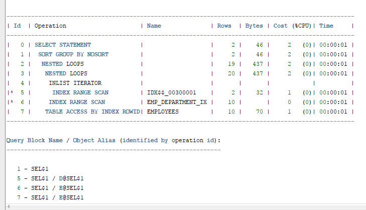

# 实验一：分析SQL执行计划，执行SQL语句的优化指导
---
### 实验内容：
- 对Oracle12c中的HR人力资源管理系统中的表进行查询与分析。
- 首先运行和分析教材中的样例：本训练任务目的是查询两个部门('IT'和'Sales')的部门总人数和平均工资，以下两个查询的结果是一样的。但效率不相同。
- 设计自己的查询语句，并作相应的分析，查询语句不能太简单。
## 1、教材中的查询语句
查询1:  
```sql 
SELECT d.department_name，count(e.job_id)as "部门总人数"，
avg(e.salary)as "平均工资"
from hr.departments d，hr.employees e
where d.department_id = e.department_id
and d.department_name in ('IT'，'Sales')
GROUP BY department_name;
```
+ 优化指导后的详细信息  
  
   
+ 所用时间  
  
查询2：  
```sql 
SELECT d.department_name，count(e.job_id)as "部门总人数"，
avg(e.salary)as "平均工资"
FROM hr.departments d，hr.employees e
WHERE d.department_id = e.department_id
GROUP BY department_name
HAVING d.department_name in ('IT'，'Sales');
```
+ 优化指导后的详细信息    
  
+ 所用时间  
   
### 1.1 教材中的查询语句分析：  
- 查询1中，通过avg函数求出职工的平均工资，通过count函数求出部门的总人数，用where子句和group by子句一起使用，分组查询可以消除非限定行的标准where子句d.department_id = e.department_id   and d.department_name in ('IT'，'Sales')，从而查询到两个部门('IT'和'Sales')的部门总人数和平均工资。
- 查询2中，也一样通过avg函数求出职工的平均工资，通过count函数求出部门的总人数，不同的是在group by子句之后使用having子句，限定条件d.department_name in ('IT'，'Sales')进行分组，这样系统仅对满足条件的组返回结果，having和where类似，唯一的差别是where过滤行，having过滤组。
## 2、自定义的查询语句：
```sql
SELECT department_name, count(job_id) as "部门总人数", 
 avg(salary) as "平均工资"
 FROM hr.employees e
 JOIN
 (SELECT d.department_id, d.department_name
 FROM hr.departments d
 WHERE d.department_name in ('IT', 'Sales'))
 USING (department_id)
GROUP BY department_name;
```
### 2.1 自定义的查询语句分析：
- 自定义的查询语句中首先执行id查询d.department_id = e.department_id， join 用于根据两个或多个表中的列之间的关系,从这些表中查询符合department_name='IT'和department_name='Sales'的部门的条件，通过avg函数求出职工的平均工资，通过count函数求出部门的总人数。
## 3、语句的执行结果分析：


