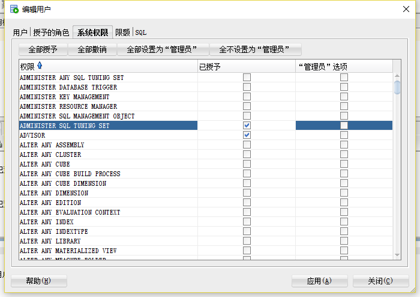

# 实验3：创建分区表

## 实验目的：  
 
掌握分区表的创建方法，掌握各种分区方式的使用场景。

## 实验内容：
- 本实验使用3个表空间：USERS,USERS02,USERS03。在表空间中创建两张表：订单表(orders)与订单详表(order_details)。
- 使用**你自己的账号创建本实验的表**，表创建在上述3个分区，自定义分区策略。
- 你需要使用system用户给你自己的账号分配上述分区的使用权限。你需要使用system用户给你的用户分配可以查询执行计划的权限。
- 表创建成功后，插入数据，数据能并平均分布到各个分区。每个表的数据都应该大于1万行，对表进行联合查询。
- 写出插入数据的语句和查询数据的语句，并分析语句的执行计划。
- 进行分区与不分区的对比实验。

## 实验参考步骤

【示例8-11】在主表orders和从表order_details之间建立引用分区
在study用户中创建两个表：orders（订单表）和order_details（订单详表），两个表通过列order_id建立主外键关联。orders表按范围分区进行存储，order_details使用引用分区进行存储。
### 1、分配权限语句是：   
```
alter user new_xh quota 50M on users02;
alter user new_xh quota 50M on users03;
```
### 执行结果：   
<br>  
### 2、order分区情况结果：   
<br> 
### 3、创建orders表的部分语句是：   
```sql
CREATE TABLE orders 
(
 order_id NUMBER(10, 0) NOT NULL 
 , customer_name VARCHAR2(40 BYTE) NOT NULL 
 , customer_tel VARCHAR2(40 BYTE) NOT NULL 
 , order_date DATE NOT NULL 
 , employee_id NUMBER(6, 0) NOT NULL 
 , discount NUMBER(8, 2) DEFAULT 0 
 , trade_receivable NUMBER(8, 2) DEFAULT 0 
) 
TABLESPACE USERS 
PCTFREE 10 INITRANS 1 
STORAGE (   BUFFER_POOL DEFAULT ) 
NOCOMPRESS NOPARALLEL 
PARTITION BY RANGE (order_date) 
(
 PARTITION PARTITION_BEFORE_2016 VALUES LESS THAN (
 TO_DATE(' 2016-01-01 00:00:00', 'SYYYY-MM-DD HH24:MI:SS', 
 'NLS_CALENDAR=GREGORIAN')) 
 NOLOGGING 
 TABLESPACE USERS 
 PCTFREE 10 
 INITRANS 1 
 STORAGE 
( 
 INITIAL 8388608 
 NEXT 1048576 
 MINEXTENTS 1 
 MAXEXTENTS UNLIMITED 
 BUFFER_POOL DEFAULT 
) 
NOCOMPRESS NO INMEMORY  
, PARTITION PARTITION_BEFORE_2017 VALUES LESS THAN (
TO_DATE(' 2017-01-01 00:00:00', 'SYYYY-MM-DD HH24:MI:SS', 'NLS_CALENDAR=GREGORIAN')) 
NOLOGGING 
TABLESPACE USERS02 
NOCOMPRESS NO INMEMORY  
, PARTITION PARTITION_BEFORE_2018 VALUES LESS THAN (
TO_DATE(' 2018-01-01 00:00:00', 'SYYYY-MM-DD HH24:MI:SS', 'NLS_CALENDAR=GREGORIAN')) 
NOLOGGING 
TABLESPACE USERS03
);
```
### 执行结果：  
<br>  
### 4、建立外键约束语句：  
```
alter table orders add primary key(order_id);
```
### 执行结果：  
<br>  

### 5、创建order_details表的部分语句如下：  
```sql
CREATE TABLE order_details 
(
id NUMBER(10, 0) NOT NULL 
, order_id NUMBER(10, 0) NOT NULL
, product_id VARCHAR2(40 BYTE) NOT NULL 
, product_num NUMBER(8, 2) NOT NULL 
, product_price NUMBER(8, 2) NOT NULL 
, CONSTRAINT order_details_fk1 FOREIGN KEY  (order_id)
REFERENCES orders  (order_id)
ENABLE 
) 
TABLESPACE USERS 
PCTFREE 10 INITRANS 1 
STORAGE (   BUFFER_POOL DEFAULT ) 
NOCOMPRESS NOPARALLEL
PARTITION BY REFERENCE (order_details_fk1)
(
PARTITION PARTITION_BEFORE_2016 
NOLOGGING 
TABLESPACE USERS --必须指定表空间,否则会将分区存储在用户的默认表空间中
 PCTFREE 10 
 INITRANS 1 
 STORAGE 
( 
 INITIAL 8388608 
 NEXT 1048576 
 MINEXTENTS 1 
 MAXEXTENTS UNLIMITED 
 BUFFER_POOL DEFAULT 
) 
NOCOMPRESS NO INMEMORY , 
PARTITION PARTITION_BEFORE_2017 
NOLOGGING 
TABLESPACE USERS02
 PCTFREE 10 
 INITRANS 1 
 STORAGE 
( 
 INITIAL 8388608 
 NEXT 1048576 
 MINEXTENTS 1 
 MAXEXTENTS UNLIMITED 
 BUFFER_POOL DEFAULT 
) 
NOCOMPRESS NO INMEMORY  ,
PARTITION PARTITION_BEFORE_2018 
NOLOGGING 
TABLESPACE USERS03
 PCTFREE 10 
 INITRANS 1 
 STORAGE 
( 
 INITIAL 8388608 
 NEXT 1048576 
 MINEXTENTS 1 
 MAXEXTENTS UNLIMITED 
 BUFFER_POOL DEFAULT 
) 
NOCOMPRESS NO INMEMORY 
);

``` 
### 执行结果：  
<br>  

### 6、详情表分区：  
<br>  

### 7、插入数据   
```
begin
for i in 1..4000
loop   
insert into orders(ORDER_ID ,customer_name, customer_tel, order_date, employee_id, trade_receivable, discount) VALUES(i,'xionghong', '18728762211', to_date ( '2015-10-21 10:31:32' , 'YYYY-MM-DD HH24:MI:SS' ), 007, 16, 7);
end loop;
    commit;
end;
/
```
### 执行结果：  
<br>  
### 8、插入数据优化指导：  
<br> 
### 9、查询结果:   
<br>
### 10、联合查询：  
<br> 
### 11、联合查询执行：  
<br> 
### 12、联合查询优化指导：  
<br> 
 
### 13、分配查询计划权限：  
<br> 
 
## 分区不分区的区别
> &nbsp;&nbsp;&nbsp;&nbsp;当表中的数据量不断增大时，查询数据的速度就会变慢，应用程序的性能就会下降，这是就应该考虑对表进行分区。表进行分区后，逻辑上仍然是一张完整的表，只是将表中的数据在物理上存放到多个表空间（物理文件上），这样查询数据时，不至于每次都扫描整张表。在这次实验中，采用了范围分区，分区键采用了日期。
> 并且在oracle中提供了强大的分区表维护操作，分区后在数据被破坏时易于维护。
